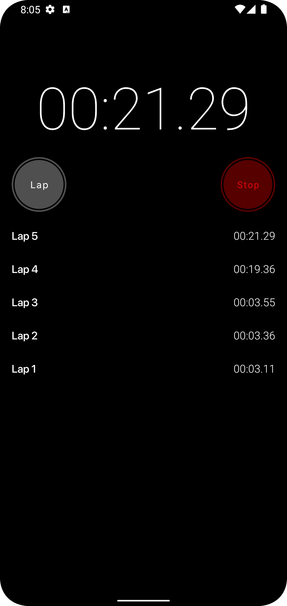
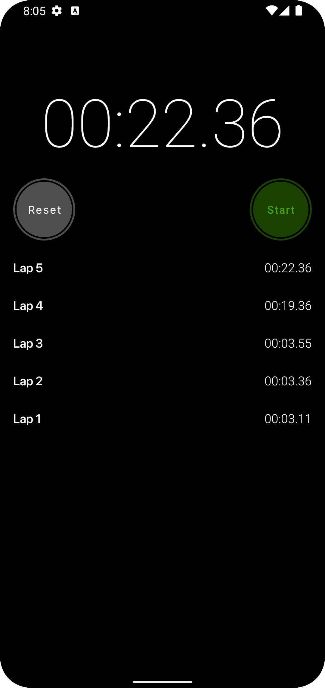
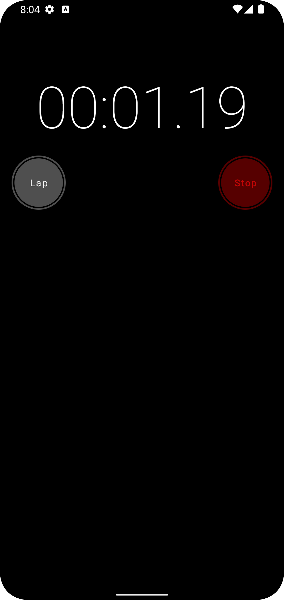

# HelixoStopwatch
This is a stopwatch app for Android that provides basic timing functionality, similar to the stopwatch feature in iOS.

# Features
- Start, stop, and reset the timer
- Record lap times
- Display the elapsed time in minutes, seconds, and milliseconds
- Dark mode

# Screenshots

# Getting Started
## Prerequisites
- Android Studio 4.0 or later
- Android SDK 21 or later
## Installation
1. Clone the repository: git clone https://github.com/your_username/your_project_name.git
2. Open the project in Android Studio.
3. Build and run the app on an emulator or a physical device.

# Usage
- Tap the "Start" button to start the stopwatch.
- Tap the "Lap" button to record a lap time. The lap time will be displayed in the list below the timer.
- Tap the "Stop" button to stop the timer.
- Tap the "Reset" button to reset the timer and clear the lap times.
